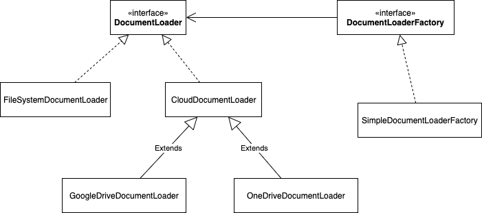
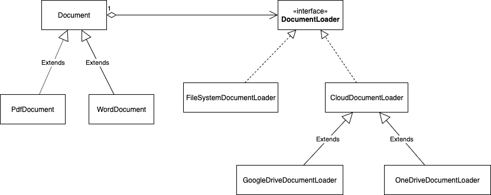
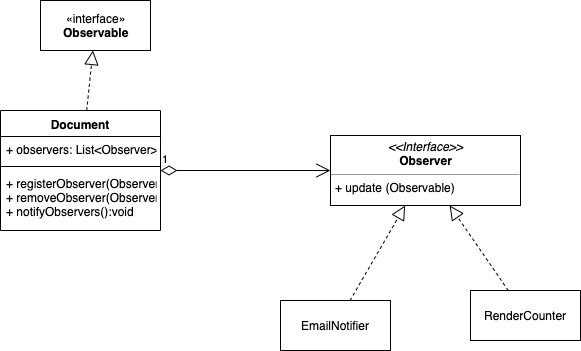
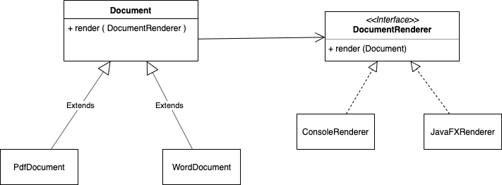
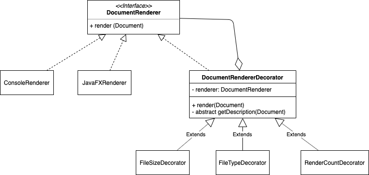

# Advanced Object Oriented Programming course

## Run the code
The main class is *edu.luc.comp473.App* and you can compile the code and run the main method.

Or you can run the code by maven with **mvn clean compile exec:exec** command.  

## Project 3,4 - Design patterns

We implemted the design of Document management system using
1. Factory Method
2. Bridge
3. Observer
4. Visitor
5. Decorator

### Factory Method
We used Factory Method pattern to create concrete Document Loader. Document Loader is an object that load document from file system or cload storage.

### Bridge Pattern
We used Bridge pattern to separate the logic (implementation) to load document from Document object.

### Observer pattern
We used Observer pattern to notify the counter and/or email notifier that a document is rendered.

### Visitor pattern
We used Visitor pattern to make it easier to add more Document Renderer further. 

### Decorator pattern
We used Decorator pattern to make more complex renderer.

